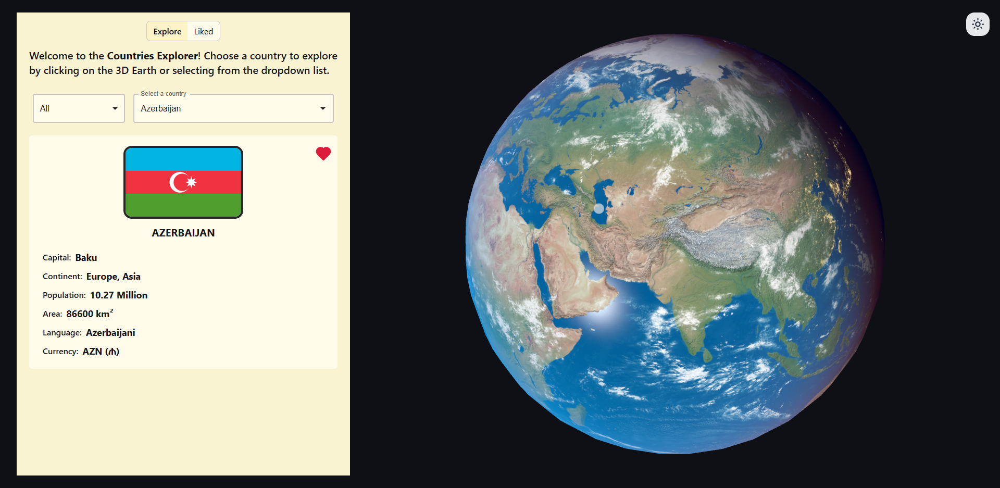

# 3D Country Explorer

Explore the world through an interactive 3D globe. Select a country from the explorer, click directly on the Earth, and discover useful country details in a focused, visual interface.

	

	<a href="https://3-d-country-explorer.vercel.app"><strong>Open the live demo</strong></a>

## Highlights

- Rotate and explore a textured 3D Earth powered by React Three Fiber.
- Select countries from the searchable country list or by clicking the globe.
- View a country’s flag, capital, continent, population, area, languages, and currency.
- Save favorite countries locally and revisit them from the Liked view.
- Switch between light and dark globe textures for a different way to explore.

## Built With

| Area                | Technology                                     |
| ------------------- | ---------------------------------------------- |
| UI                  | React, React Router, Material UI, Tailwind CSS |
| 3D experience       | React Three Fiber, Drei, Three.js, GLSL        |
| State               | Redux Toolkit                                  |
| Motion and feedback | GSAP, React Hot Toast                          |
| Data                | REST Countries API                             |
